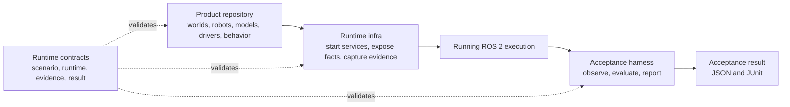

# Robotics Acceptance Harness

[](https://github.com/mmkolpakov/robotics-acceptance-harness/actions/workflows/ci.yml)
[](https://github.com/mmkolpakov/robotics-acceptance-harness/releases/latest)
[](LICENSE)

Turn an already running ROS 2 execution into a reproducible acceptance verdict.

Use this repository to:

1. **Explain** and cross-check a scenario, runtime, model, dataset, and physical
   authorization bundle before observation starts.
2. **Observe** the declared ROS graph, lifecycle states, OpenTelemetry metrics,
   and finalized evidence without controlling the system.
3. **Report** a contract-valid acceptance result and JUnit XML for CI.

The harness is attach-only. It does not start containers, launch nodes, change
lifecycle states, control a simulator, verify signatures, or send commands to
physical equipment.

## Where It Fits



The end-to-end handoff is machine-readable: a product repository supplies its
workload and scenario, runtime infra emits observed runtime and evidence facts,
and the harness emits an acceptance result plus JUnit. Each layer can evolve
and be tested independently.

The document model is published by
[`robotics-runtime-contracts`](https://github.com/mmkolpakov/robotics-runtime-contracts).
The reference ROS 2, Gazebo, playback, evidence, and observer images are
published by
[`robotics-runtime-infra`](https://github.com/mmkolpakov/robotics-runtime-infra).

## Choose a Command

| Goal | Interface | Starts or controls the system |
| --- | --- | --- |
| Create an immutable run context | `robotics-acceptance create-run` | No |
| Validate and explain an execution bundle | `robotics-acceptance explain` | No |
| Observe a running execution and decide a verdict | `robotics-acceptance verify` | No |
| Re-evaluate finalized evidence | `robotics-acceptance evaluate` | No |
| Aggregate the complete set of domain results | `robotics-acceptance aggregate` | No |
| Qualify transport without a domain execution | `robotics-acceptance transport-evaluate` | No |
| Aggregate repeated runs | `robotics-acceptance campaign` | No |
| Inspect readiness or a verdict | `robotics-acceptance doctor`, `why` | No |
| Reuse a validated simulation bundle in project tests | `robotics_bundle` pytest fixture | No |

## Baseline

| Component | Supported baseline |
| --- | --- |
| Python | 3.12 and 3.13 |
| Contracts | `robotics-runtime-contracts>=0.15,<0.16` |
| Scenarios | `acceptance-scenario.v5` (`v4` remains readable) |
| Results | `acceptance-result.v5` (`v4` remains readable) |
| Aggregates | `acceptance-aggregate.v4` |
| Transport qualification | `transport-qualification-result.v2` (`v1` without clock relations) |
| ROS observation | ROS 2 Jazzy with `rclpy` and declared message packages |
| Metrics | Newline-delimited OTLP JSON from the Collector file exporter |

`explain` needs only Python. `verify` runs in a ROS-enabled environment and
joins an existing `ROS_DOMAIN_ID`. Hardware support is qualified by the runtime
infrastructure for an exact source revision, image digest, and device; installing
this package alone does not qualify a target.

## Install

Install the attested `v0.17.1` release with its exact contracts baseline:

```bash
CONTRACTS=https://github.com/mmkolpakov/robotics-runtime-contracts/releases/download/v0.15.3/robotics_runtime_contracts-0.15.3-py3-none-any.whl
HARNESS=https://github.com/mmkolpakov/robotics-acceptance-harness/releases/download/v0.17.1/robotics_acceptance_harness-0.17.1-py3-none-any.whl
uv tool install \
  --with "${CONTRACTS}" \
  "${HARNESS}"
```

Release provenance verification is described in
[`docs/supply-chain.md`](docs/supply-chain.md).

For development:

```bash
git clone https://github.com/mmkolpakov/robotics-runtime-contracts.git
git clone https://github.com/mmkolpakov/robotics-acceptance-harness.git
cd robotics-acceptance-harness
uv sync --locked --all-groups
uv run robotics-acceptance --version
```

Keep both repositories as sibling directories. The published harness metadata
contains a standard contracts version range; the sibling path in
`tool.uv.sources` is only a development and CI source. The acceptance-observer
image from `robotics-runtime-infra` supplies ROS 2 Jazzy packages for live
observation. A plain Python environment is sufficient for document-only
commands and the pytest plugin.

## Quick Start

Use the known-good simulation fixture after the development install:

```bash
uv run robotics-acceptance explain \
  --scenario tests/fixtures/simulation/scenario.yaml \
  --runtime tests/fixtures/simulation/runtime.yaml
```

The command validates and cross-checks both documents, then prints the resolved
execution mode, workload, ROS graph size, evidence policy, and content digests.
The known-good fixture reports `"policy": "accepted-simulation"` and exits
with code `0`.

Create the immutable context shared by every domain in one execution:

```bash
robotics-acceptance create-run \
  --scenario /run/robotics/scenario.yaml \
  --output /run/robotics/acceptance-run.json \
  --domain primary=observer \
  --time-authority sim_clock \
  --time-source gazebo-clock
```

## Verify an Execution

Start the runtime, recorder, and OpenTelemetry Collector outside the harness,
then attach the observer:

```bash
robotics-acceptance verify \
  --scenario /run/robotics/scenario.yaml \
  --runtime /run/robotics/runtime-manifest.json \
  --run-id run-7dd792f2-4f75-4f4d-81b0-48c8c2a8f76c \
  --domain-id cell \
  --run-context /run/robotics/acceptance-run.json \
  --evidence-index /run/robotics/evidence-index.json \
  --otel-metrics /run/robotics/metrics.otlp.json \
  --measurement-complete /run/robotics/measurement-complete \
  --output /run/robotics/results
```

Exit code `0` means passed, `1` means a completed failed verdict, and `2` means
invalid input or an observation error. Outputs are written atomically:

```text
/run/robotics/results/acceptance-result.json
/run/robotics/results/junit.xml
```

The recorder finalizes its evidence index only after the harness creates
`--measurement-complete`. The OTLP file is accepted only when that index covers
its exact path, media type, byte size, and SHA-256 digest.

For finalized retained evidence, run the same metric, evidence, and product
evaluators without joining a ROS graph:

```bash
robotics-acceptance evaluate \
  --scenario scenario.yaml --runtime runtime.json \
  --run-id "$RUN_ID" --domain-id cell --run-context acceptance-run.json \
  --evidence-index evidence-index.json --otel-metrics metrics.otlp.json \
  --window-start-ns 1786000000000000000 \
  --window-end-ns 1786000030000000000 \
  --output results
```

Offline results explicitly mark live graph, clock, safety-boundary, and shutdown
observations as unevaluated, so they cannot claim a complete passing verdict.

## Aggregate Results

Aggregate exactly the domains declared by one immutable run context:

```bash
robotics-acceptance aggregate \
  --scenario /run/robotics/scenario.yaml \
  --run-context /run/robotics/acceptance-run.json \
  --result /run/robotics/domain-a/acceptance-result.json \
  --result /run/robotics/domain-b/acceptance-result.json \
  --transport-qualification /run/robotics/transport-qualification.json \
  --output /run/robotics/acceptance-aggregate.json
```

`transport-evaluate` checks channel delivery and causal traces without a runtime
manifest or per-domain result. It requires the resolved scenario so the measured
clock relation is evaluated against the scenario-owned policy, emits a
`transport-qualification-result.v2` document, and is the canonical interface for
qualifying bridges and isolated ROS domain transport. `aggregate` verifies and
references that result by digest; omit `--transport-qualification` when
cross-domain evidence was not evaluated. These commands return `0` for
`passed`, `1` for a completed non-passing verdict, and `2` for invalid input.

For each channel, the first producer span opens the declared observation
window. Every counted producer and consumer span must fit completely inside
that window. Producer message identifiers must be unique; repeated consumer
identifiers are counted as duplicate deliveries and evaluated against the
channel contract.

Supply `--scenario PATH` and one `--clock-relation PATH` per measured directed
cross-domain pair. Each relation copies the scenario policy, binds its digest,
and references evidence retained by a supplied domain index. A missing pair
produces `incomplete`, never `passed`. Repeated run aggregates can then be
summarized with `campaign`; the command never schedules or repeats workloads:

```bash
robotics-acceptance campaign \
  --scenario scenario.yaml \
  --run-context run-a.json --aggregate aggregate-a.json \
  --run-context run-b.json --aggregate aggregate-b.json \
  --minimum-passed-runs 2 \
  --output campaign-summary.json
```

Run contexts and aggregates are paired by argument order and must reference the
same resolved scenario digest.

## Inputs

| Input | Required when | Contract |
| --- | --- | --- |
| Scenario | `explain`, `verify`, `evaluate`, pytest | `acceptance-scenario.v5` (`v4` readable) |
| Runtime manifest | `explain`, `verify`, `evaluate`, pytest | `runtime-manifest.v3` (`v1`/`v2` readable) |
| Model manifest | Inference workload | `model-artifact-manifest.v1` |
| Dataset manifest | MCAP playback | `dataset-manifest.v1` |
| Execution permit | HIL or real target | `execution-permit.v1` |
| Verification record | HIL or real target | `execution-verification.v1` |
| Evidence index | `verify`, `evaluate` | `evidence-index.v3` (`v2` readable) |
| Metrics | Metric assertions or physical observation | OTLP JSON |
| Run context | `verify`, `aggregate` | `acceptance-run.v1` |
| Channel, clock, and causal-chain contracts | `transport-evaluate` | `zenoh-channel.v1`, `clock-relation.v1`, `causal-chain.v1` |

Local domain extensions remain explicit and digest-pinned. Supply the same
`--extension-schema URI=PATH` arguments to every command that reads the
scenario, including `create-run`, `aggregate`, `transport-evaluate`, and
`campaign`:

```bash
robotics-acceptance explain \
  --scenario scenario.yaml \
  --runtime runtime.json \
  --extension-schema https://schemas.example.org/sorting.v1.schema.json=sorting-extension.schema.json
```

Extensions cannot override common safety, timing, transport, or evidence rules.

## Execution Scope

| Target | Verdict scope |
| --- | --- |
| Simulation | Real-time, stepped, and MCAP playback observation |
| HIL | Read-only observation with `physical_effect: none` |
| Real robot | Read-only observation with `physical_effect: observation` |

External infrastructure must verify two authorized signatures and evaluate the
execution policy before creating an `execution-verification.v1` record. The
harness then cross-checks the permit, verification record, runtime image,
target identity, hardware scope, policy digest, and validity interval.

Every forbidden command topic, service, and action is monitored during graph
readiness and throughout the measurement window. Any publisher or server,
including a transient one, fails the result. Expected topics are checked for
type, publisher and subscriber counts, first-message deadline, and publisher
compatibility with the observer's declared subscription QoS. This does not
prove compatibility between arbitrary application endpoints. Managed nodes
must remain in their required state for the declared stability window; the
harness never requests a lifecycle transition.

Physical observation also validates aligned OTLP measurements for clock offset,
clock drift, message age, and monotonicity, including their units, source, and
synchronization protocol.

Run-scoped simulation uses standard OTLP instruments:

| Measurement | OTLP instrument | Required attributes |
| --- | --- | --- |
| `robotics.time_authority.delivery_latency` (`ms`) | Delta explicit-bucket histogram of RMW source-to-reception latency | `run.id`, `domain.id`, `time.source.id`, `time.measurement.method=rmw_source_to_reception_latency` |
| `robotics.message.age` (`ms`) | Delta explicit-bucket histogram | `run.id`, `domain.id`, `channel` |
| `robotics.message.received` (`{message}`) | Delta monotonic sum | `run.id`, `domain.id`, `channel` |
| `robotics.message.lost` (`{message}`) | Delta monotonic sum | `run.id`, `domain.id`, `channel` |
| `robotics.message.sequence_error` (`{message}`) | Delta monotonic sum | `run.id`, `domain.id`, `channel` |
| `robotics.simulation.deadline_miss_ratio` (`1`) | Gauge sampled in the measurement window | `run.id`, `domain.id` |

The data-plane verdict requires one unambiguous measured channel. Loss is
derived from the received and lost counters over the measurement window;
precomputed LastValue loss ratios are not accepted. Histogram percentiles use
the conservative bound appropriate for the assertion direction. Missing,
duplicate, or non-monotonic DDS publication sequence metadata fails the
data-plane integrity assertion.

The result contract names this measurement as delivery latency. It does not validate
the `/clock` payload or hardware clock synchronization. The observer separately
checks payload monotonicity, advancement, configured step multiples, and
real-time factor; HIL observation uses dedicated hardware clock-offset metrics.
A frozen or malformed simulation clock fails even when delivery latency is
within policy.

## Pytest Plugin

Project-owned simulation tests can consume the validated bundle directly:

```bash
uv run pytest \
  -p robotics_acceptance_harness.plugin \
  --robotics-scenario scenario.yaml \
  --robotics-runtime runtime.json
```

Supply scenario extensions with repeated
`--robotics-extension-schema URI=PATH` arguments. The URI must equal the
digest-pinned schema declaration and the schema's `$id`.

Use `robotics_bundle` for the cross-checked bundle or `robotics_scenario` for
the immutable scenario mapping. Pass `--robotics-run-context` to expose the
immutable `robotics_run_context` fixture. Tests can use
`@pytest.mark.robotics_assertion("assertion-id")`; collection fails when the ID is
not declared by the scenario. The plugin exposes no permit option and refuses
physical targets.

## Product Evaluators

Product packages extend verdicts through the standard Python entry-point group
`robotics_acceptance.evaluators`:

```toml
[project.entry-points."robotics_acceptance.evaluators"]
"org.example.sorting" = "sorting_acceptance:evaluate"
```

The callable receives an immutable `EvaluationContext` and returns
`AssertionEvaluation` objects marked with `source="product"`, its entry-point
namespace, and at least one SHA-256 already present in the verified evidence
index. Duplicate IDs, foreign namespaces, unknown digests, and non-callable
entry points fail closed. Live and offline commands invoke this same API.

## Environment and CLI

Document paths, run identity, domain identity, and output paths are CLI
arguments. The harness defines no private environment-variable fallback for
them.

Live ROS observation inherits standard ROS environment from the runtime:

| Variable | Purpose |
| --- | --- |
| `ROS_DOMAIN_ID` | Select the domain observed by `verify` |
| `RMW_IMPLEMENTATION` | Select the qualified ROS middleware implementation |
| `ROS_SECURITY_ENABLE` | Enable DDS Security in the ROS client |
| `ROS_SECURITY_STRATEGY` | Use `Enforce` for a protected deployment |
| `ROS_SECURITY_KEYSTORE` | Locate the externally provisioned SROS2 keystore |

`explain`, `evaluate`, `aggregate`, `campaign`, `doctor`, `why`, and
`transport-evaluate` do not join a ROS graph. A
`run_id` uses the canonical lowercase `run-<uuid4>` form. For complete command
syntax, use `robotics-acceptance COMMAND --help`.

## Development

```bash
uv sync --locked --all-groups
uv run pre-commit run --all-files
uv run coverage run --branch -m pytest \
  -p robotics_acceptance_harness.plugin \
  --robotics-scenario tests/fixtures/simulation/scenario.yaml \
  --robotics-runtime tests/fixtures/simulation/runtime.yaml
uv run coverage report --fail-under=80
uv build --no-sources
```

Semgrep enforces the attach-only boundary and tests its policy rules. Security
reports follow [SECURITY.md](SECURITY.md), contributions follow
[CONTRIBUTING.md](CONTRIBUTING.md), and the project uses the [MIT License](LICENSE).

## Project Policies

* [Compatibility policy](docs/compatibility.md)
* [Architecture decisions](docs/decisions/README.md)
* [Supply-chain assurance](docs/supply-chain.md)
* [REP-2004 quality declaration](QUALITY_DECLARATION.md)

The package currently claims REP-2004 **Quality Level 4**. It is pre-`1.0.0`
and does not claim the stable-version requirement of Quality Level 3.
